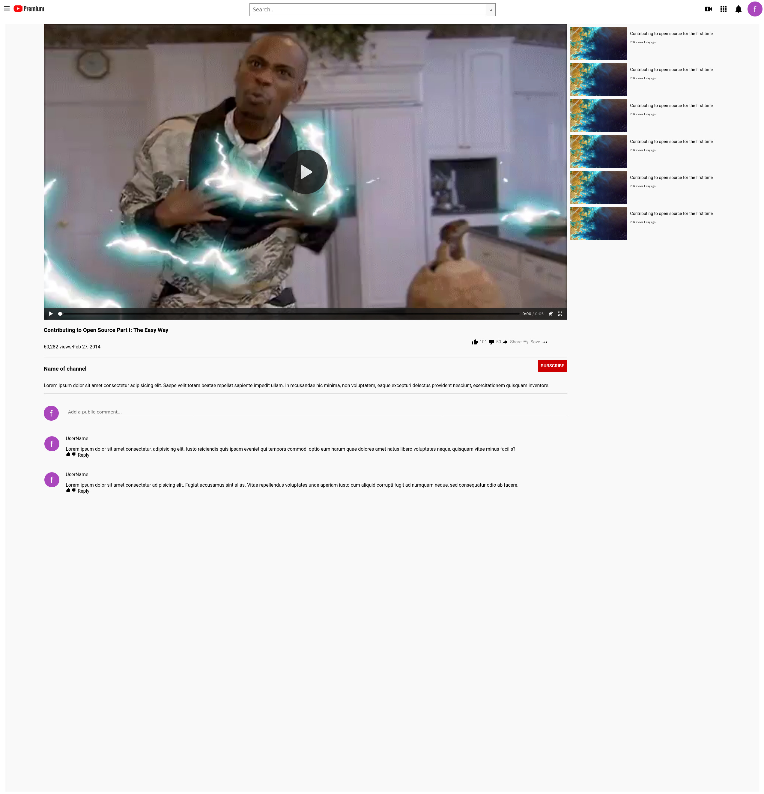

# Youtube Player Page Clone

> This is a youtube player page clone which made for Microverse Technical Curriculum Project 1

Additional description about the project and its features.

## Built With

- HTML
- CSS

## Live Demo

[Live Demo Link](https://sinansevgi.github.io/flowyoutube/)

## Authors

👤 **Nikola Zdrale**

- GitHub: [@zdrale](https://github.com/zdrale)

👤 **Sinan Sevgi**

- GitHub: [@sinansevgi](https://github.com/sinansevgi)

## 🤝 Contributing

Contributions, issues, and feature requests are welcome!

## Show your support

Give a ⭐️ if you like this project!

## Acknowledgments

- Check out the Css flex

## 📝 License

This project is [MIT](lic.url) licensed.
